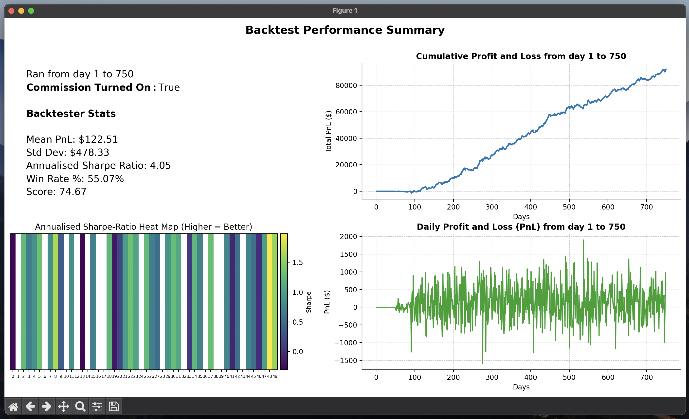

# SIG x UNSW Algothon 2025



This repository contains our strategy implementations for the algothon. You can pull this 
project onto your local machine by creating a new folder, opening a terminal on that folder and 
type in the following commands

```shell
git init
git remote add origin git@github.com:johnpioc/sig-algothon-2025.git
git pull origin main
```

### Important Notes!!!

**Version Control Safety**

Each person has their own `strategy.py` file. You must only edit on this file to avoid merge 
  conflicts.

If you want to work on your strategy and edit your `strategy.py` file, branch first out of main.
You can do this by typing this in the command line:

```shell
git branch [BRANCH_NAME: make it descriptive. For e.g., inukas-strategy-v1]
git checkout [BRANCH_NAME]
```

Now that you're in your branch, you can freely edit your strategy file. 

We will also be updating `backtester.py` and `analysis.py` throughout the competition. When we do
roll out an update, the updated files will appear on main. You don't have to close your branch 
so that you can get these updates, instead just run the following commands:

```shell
git fetch origin main
git checkout origin/main -- backtester.py analysis.py
```

This way, your backtester and analysis files will update to what's on the main branch, but your
individual branch stays intact.

**Your get_[name]s_positions() function**

Each person will have a get_[name]s_position function, for e.g., get_aprils_positions(). This comes
with two parameters: 

- prices_so_far: it's a pandas Dataframe that gives you the prices from day 0 to the current day 
  (this current day is determined by the function that calls it). It holds the prices of each 
  instrument for the specified timeline
-  allocated_instruments: this is a list of integers that indicates which instruments you are 
   responsible for during the algothon.

Your function must return an `ndarray` of size 50, and for each of your allocated instruments 
you must specify their positions in their respective index on the array.

- For e.g., if you were allocated instrument 32 and that only, your return value would be an 
  array of all zeroes however the 32nd index has your desired positions for instrument 32